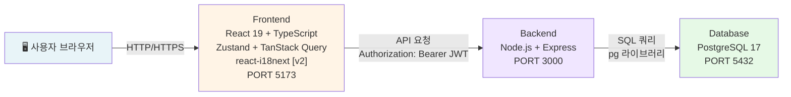
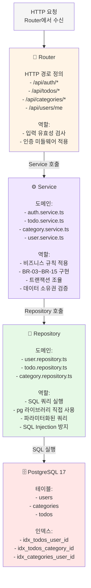
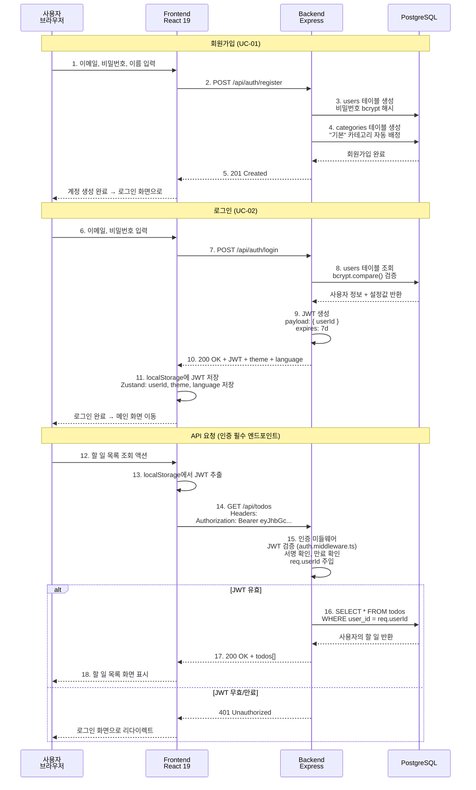
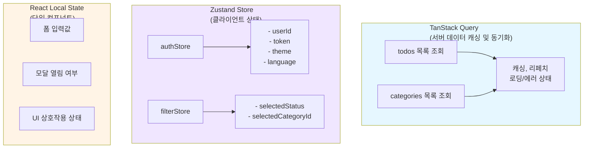
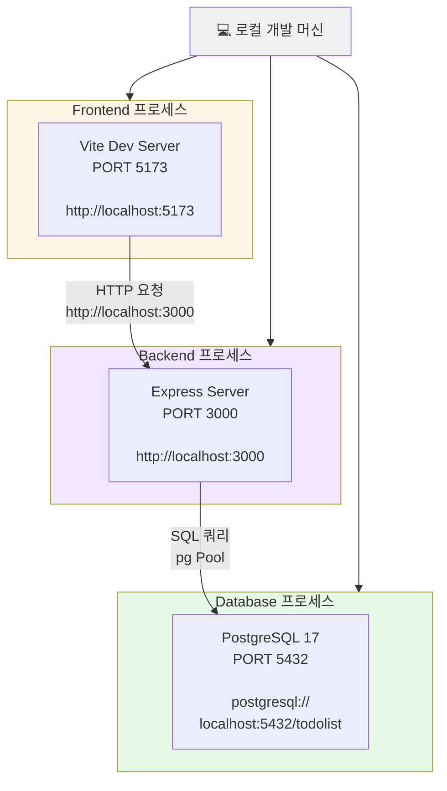
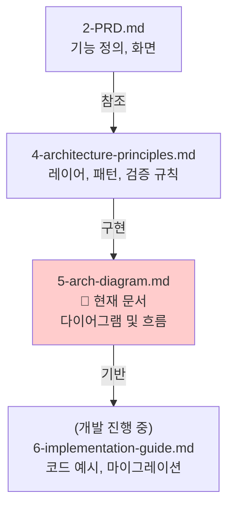

# TodoList 기술 아키텍처 다이어그램

---

**버전**: v1.3
**작성자**: sunwoong-data  
**작성일**: 2026-05-27  
**최종 수정일**: 2026-05-30 (v1.3)
**참조 문서**: `docs/2-PRD.md`, `docs/4-architecture-principles.md`

| 버전 | 날짜       | 변경 내용                       |
| ---- | ---------- | ------------------------------- |
| v1.0 | 2026-05-27 | 최초 작성 — 4개 다이어그램 포함 |
| v1.1 | 2026-05-27 | 1번 다이어그램 FE 스택에 react-i18next [v2] 추가, 4번 시퀀스 "React" → "React 19" 통일 |
| v1.2 | 2026-05-28 | 백엔드 파일 경로 `.ts` → `.js` 반영. Swagger UI 엔드포인트 추가 |
| v1.3 | 2026-05-30 | PostgreSQL ERD에 assignees, anniversaries 테이블 추가. API 경로에 신규 엔드포인트 추가 |

---

## 1. 시스템 전체 구조 (3-Tier Architecture)

사용자 브라우저부터 데이터베이스까지의 전체 시스템 레이어 및 통신 흐름을 나타냅니다.



---

## 2. 백엔드 레이어 구조 (단방향 의존성)

Express 서버 내 Router → Service → Repository → PostgreSQL 단방향 의존성 구조를 나타냅니다.



---

## 3. 데이터베이스 ERD (Entity Relationship Diagram)

사용자, 카테고리, 할 일 테이블 간 관계 및 주요 컬럼을 나타냅니다.

```mermaid
erDiagram
    USERS ||--o{ CATEGORIES : owns
    USERS ||--o{ TODOS : owns
    CATEGORIES ||--o{ TODOS : contains

    USERS {
        UUID id PK
        VARCHAR email UK
        VARCHAR password
        VARCHAR name
        VARCHAR theme_preference "light|dark"
        VARCHAR language_preference "ko|en|ja"
        TIMESTAMPTZ created_at
        TIMESTAMPTZ updated_at
    }

    CATEGORIES {
        UUID id PK
        UUID user_id FK
        VARCHAR name
        BOOLEAN is_default
        UNIQUE "user_id, name"
    }

    TODOS {
        UUID id PK
        UUID user_id FK
        UUID category_id FK
        VARCHAR title
        TEXT description
        DATE start_date "선택값"
        DATE end_date "선택값"
        BOOLEAN is_completed
        TIMESTAMPTZ created_at
        TIMESTAMPTZ updated_at
    }
```

**주요 제약사항**

- `users.id` → `categories.user_id`: ON DELETE CASCADE
- `users.id` → `todos.user_id`: ON DELETE CASCADE
- `categories.id` → `todos.category_id`: FK 제약
- `categories(user_id, name)`: 사용자별 카테고리명 고유
- DB 인덱스: `todos.user_id`, `todos.category_id`, `categories.user_id`

---

## 4. 인증 흐름 (JWT 기반)

회원가입/로그인 → JWT 발급 → 이후 API 요청에서 토큰 검증 흐름을 나타냅니다.



**주요 보안 체크포인트**

- 비밀번호는 bcrypt 해시로 저장 (평문 저장 금지)
- JWT payload는 `userId` 최소 정보만 포함 (최소 권한 원칙)
- 모든 API 요청: `Authorization: Bearer <token>` 헤더 검증 필수
- 토큰 만료: 7일 (환경 변수로 설정 가능)

---

## 5. 프론트엔드 상태 관리 분리

서버 상태(TanStack Query)와 클라이언트 상태(Zustand)의 역할 분담을 나타냅니다.



**역할 정의**

- **TanStack Query**: Todo 목록, Category 목록 등 서버 데이터 관리
- **Zustand**: 로그인 정보, 현재 테마, 현재 언어, 선택된 필터
- **React useState**: 폼 입력값, 모달 상태 등 단일 컴포넌트 내부 상태

---

## 6. API 통신 예시 (할 일 목록 조회)

UC-05 구현 시 프론트-백엔드 통신 흐름입니다.

```mermaid
sequenceDiagram
    participant FE as Frontend
    participant API as Backend API
    participant DB as PostgreSQL

    rect rgb(200, 220, 255)
    Note over FE,DB: UC-05: 할 일 목록 조회 (필터 포함)

    FE->>FE: 현재 필터 상태 조회<br/>(filterStore 에서)
    FE->>FE: query 파라미터 조합<br/>?status=in_progress<br/>&category_id=uuid

    FE->>API: GET /api/todos?status=in_progress<br/>&category_id=uuid<br/>Authorization: Bearer JWT

    API->>API: auth.middleware<br/>JWT 검증 → userId 추출

    API->>DB: SELECT * FROM todos<br/>WHERE user_id = $1<br/>AND is_completed = false<br/>AND start_date <= CURRENT_DATE<br/>AND (end_date IS NULL<br/>OR end_date >= CURRENT_DATE)<br/>AND category_id = $2<br/>ORDER BY created_at DESC

    DB-->>API: todos[] 반환<br/>(필터 조건에 맞는 항목만)

    API-->>FE: 200 OK<br/>{<br/>&nbsp;&nbsp;data: [<br/>&nbsp;&nbsp;&nbsp;&nbsp;{<br/>&nbsp;&nbsp;&nbsp;&nbsp;&nbsp;&nbsp;id, title, startDate,<br/>&nbsp;&nbsp;&nbsp;&nbsp;&nbsp;&nbsp;endDate, isCompleted, ...<br/>&nbsp;&nbsp;&nbsp;&nbsp;},<br/>&nbsp;&nbsp;&nbsp;&nbsp;...<br/>&nbsp;&nbsp;]<br/>}

    FE->>FE: TanStack Query<br/>데이터 캐싱

    FE-->>FE: 컴포넌트 리렌더링<br/>필터된 할 일 목록 표시
    end
```

---

## 7. 배포 구조 (개발 환경 기준)

로컬 개발 환경에서의 포트 및 서버 구성을 나타냅니다.



**환경 변수 참고**

- Frontend: `VITE_API_BASE_URL=http://localhost:3000`
- Backend: `PORT=3000`, `DB_HOST=localhost`, `DB_PORT=5432`

---

## 8. 개발자 참고사항

### 8-1. 주요 파일 경로

```
frontend/src/
├── api/                      # API 호출 함수 (axios/fetch)
│   ├── authApi.ts
│   ├── todoApi.ts
│   └── categoryApi.ts
├── hooks/                    # TanStack Query + 커스텀 훅
│   ├── useTodos.ts
│   ├── useCategories.ts
│   └── useAuth.ts
└── store/                    # Zustand 스토어
    ├── authStore.ts          # userId, token, theme, language
    └── filterStore.ts        # selectedStatus, selectedCategoryId

backend/src/
├── routes/                   # 라우터 — HTTP 경로
│   ├── auth.router.js
│   ├── todos.router.js
│   ├── categories.router.js
│   └── users.router.js
├── services/                 # 비즈니스 로직
│   ├── auth.service.js
│   ├── todo.service.js
│   ├── category.service.js
│   └── user.service.js
├── repositories/             # DB 쿼리
│   ├── user.repository.js
│   ├── todo.repository.js
│   └── category.repository.js
├── middlewares/
│   ├── auth.middleware.js
│   └── errorHandler.js
├── utils/
│   └── logger.js             # 콘솔 로거
└── db/
    └── pool.js               # pg Pool 설정
```

### 8-2. 레이어 간 호출 원칙

- **Router → Service**: HTTP 요청에서 추출한 데이터 전달
- **Service → Repository**: 비즈니스 규칙 검증 후 DB 작업 요청
- **Repository → PostgreSQL**: 파라미터화된 SQL 쿼리만 사용

**금지 사항**

- Router가 Repository를 직접 호출 금지
- Service가 HTTP 컨텍스트(req, res) 직접 접근 금지
- ORM(Prisma, Sequelize) 사용 금지 — pg만 사용

### 8-3. 인증 검증 흐름

1. 클라이언트: `Authorization: Bearer <token>` 헤더 포함
2. 미들웨어: JWT 검증 → `req.userId` 주입
3. Router/Service: 요청 처리 시 자동으로 인증된 사용자 context 사용

### 8-4. 데이터 소유권 검증 (BR-02, BR-05)

모든 Todo, Category 조회/수정/삭제 시:

```javascript
// 서비스에서 필수 검증 (todo.service.js)
const existing = await todoRepo.findByIdAndUserId(id, userId);
if (!existing) {
  throw new AppError(403, 'FORBIDDEN', '다른 사용자의 할 일에 접근할 수 없습니다.');
}
```

---

## 문서 관계도



---

**마지막 업데이트**: 2026-05-27
