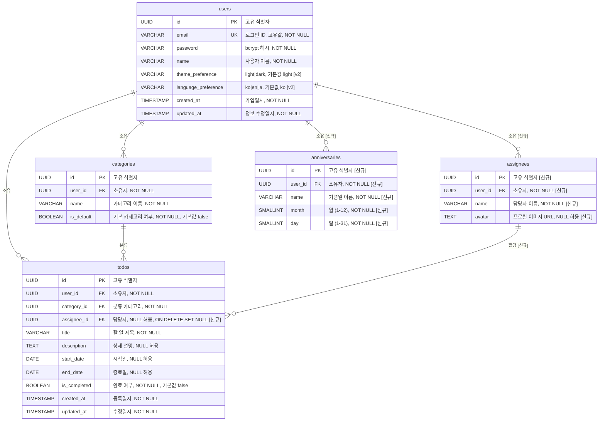

# TodoList ERD (Entity Relationship Diagram)

---

**버전**: v1.1
**작성자**: sunwoong-data
**작성일**: 2026-05-27
**최종 수정일**: 2026-05-30 (v1.1)
**참조 문서**: `docs/1-domain-definition.md`, `docs/2-PRD.md`

| 버전 | 날짜       | 변경 내용 |
| ---- | ---------- | --------- |
| v1.0 | 2026-05-27 | 최초 작성 |
| v1.1 | 2026-05-30 | 신규 테이블 추가: assignees, anniversaries. todos.assignee_id FK 컬럼 추가 |

---

## 1. ERD 다이어그램

> **참고**: Todo의 `status`(상태)는 테이블에 저장되지 않는 파생 계산값입니다.
> `is_completed`, `start_date`, `end_date`, 현재 날짜를 조합하여 런타임에 계산합니다.
> 상태 계산 기준은 [섹션 5. 비고](#5-비고)를 참조하십시오.

---

## 2. 테이블 정의

### 2-1. users (사용자)

| 컬럼명              | 타입         | 제약조건                            | 기본값            | 설명                   |
| ------------------- | ------------ | ----------------------------------- | ----------------- | ---------------------- |
| id                  | UUID         | PK, NOT NULL                        | gen_random_uuid() | 고유 식별자            |
| email               | VARCHAR(255) | UNIQUE, NOT NULL                    | —                 | 로그인 ID              |
| password            | VARCHAR(255) | NOT NULL                            | —                 | bcrypt 해시된 비밀번호 |
| name                | VARCHAR(100) | NOT NULL                            | —                 | 사용자 이름            |
| theme_preference    | VARCHAR(10)  | NOT NULL, CHECK IN ('light','dark') | 'light'           | 테마 설정 `[v2]`       |
| language_preference | VARCHAR(5)   | NOT NULL, CHECK IN ('ko','en','ja') | 'ko'              | 언어 설정 `[v2]`       |
| created_at          | TIMESTAMP    | NOT NULL                            | NOW()             | 가입일시               |
| updated_at          | TIMESTAMP    | NOT NULL                            | NOW()             | 정보 수정일시          |

### 2-2. categories (카테고리)

| 컬럼명     | 타입         | 제약조건                | 기본값            | 설명                                                       |
| ---------- | ------------ | ----------------------- | ----------------- | ---------------------------------------------------------- |
| id         | UUID         | PK, NOT NULL            | gen_random_uuid() | 고유 식별자                                                |
| user_id    | UUID         | FK → users.id, NOT NULL | —                 | 카테고리 소유자                                            |
| name       | VARCHAR(100) | NOT NULL                | —                 | 카테고리 이름 (동일 사용자 내 고유: UNIQUE(user_id, name)) |
| is_default | BOOLEAN      | NOT NULL                | false             | 기본 카테고리 여부                                         |

### 2-3. todos (할 일)

| 컬럼명       | 타입         | 제약조건                     | 기본값            | 설명                                                       |
| ------------ | ------------ | ---------------------------- | ----------------- | ---------------------------------------------------------- |
| id           | UUID         | PK, NOT NULL                 | gen_random_uuid() | 고유 식별자                                                |
| user_id      | UUID         | FK → users.id, NOT NULL      | —                 | 할 일 소유자                                               |
| category_id  | UUID         | FK → categories.id, NOT NULL | —                 | 분류 카테고리                                              |
| assignee_id  | UUID         | FK → assignees.id, NULL 허용 | NULL              | 담당자 (BR-17, ON DELETE SET NULL) `[신규]`               |
| title        | VARCHAR(255) | NOT NULL                     | —                 | 할 일 제목                                                 |
| description  | TEXT         | NULL 허용                    | NULL              | 상세 설명                                                  |
| start_date   | DATE         | NULL 허용                    | NULL              | 시작일 (BR-07: 필수값 아님)                                |
| end_date     | DATE         | NULL 허용                    | NULL              | 종료일 (BR-07: 필수값 아님, BR-06: start_date 이후여야 함) |
| is_completed | BOOLEAN      | NOT NULL                     | false             | 완료 여부                                                  |
| created_at   | TIMESTAMP    | NOT NULL                     | NOW()             | 등록일시                                                   |
| updated_at   | TIMESTAMP    | NOT NULL                     | NOW()             | 수정일시                                                   |

### 2-4. assignees (담당자) `[신규]`

| 컬럼명 | 타입         | 제약조건                 | 기본값            | 설명                      |
| ------ | ------------ | ----------------------- | ----------------- | ----------------------- |
| id     | UUID         | PK, NOT NULL            | gen_random_uuid() | 고유 식별자             |
| user_id | UUID        | FK → users.id, NOT NULL | —                 | 담당자 소유자           |
| name   | VARCHAR(100) | NOT NULL                | —                 | 담당자 이름             |
| avatar | TEXT         | NULL 허용               | NULL              | 프로필 이미지 URL       |

### 2-5. anniversaries (기념일) `[신규]`

| 컬럼명 | 타입         | 제약조건                 | 기본값            | 설명                      |
| ------ | ------------ | ----------------------- | ----------------- | ----------------------- |
| id     | UUID         | PK, NOT NULL            | gen_random_uuid() | 고유 식별자             |
| user_id | UUID        | FK → users.id, NOT NULL | —                 | 기념일 소유자           |
| name   | VARCHAR(100) | NOT NULL                | —                 | 기념일 이름             |
| month  | SMALLINT     | NOT NULL                | —                 | 월 (1-12)              |
| day    | SMALLINT     | NOT NULL                | —                 | 일 (1-31)              |

---

## 3. 관계 정의

| 관계               | 카디널리티 | FK 컬럼            | 참조 컬럼     | ON DELETE | 설명                                       |
| ------------------ | ---------- | ------------------ | ------------- | --------- | ------------------------------------------ |
| users → categories | 1:N        | categories.user_id | users.id      | CASCADE   | 사용자 삭제 시 소유 카테고리 전체 삭제     |
| users → todos      | 1:N        | todos.user_id      | users.id      | CASCADE   | 사용자 삭제 시 소유 할 일 전체 삭제        |
| users → assignees  | 1:N        | assignees.user_id  | users.id      | CASCADE   | 사용자 삭제 시 소유 담당자 전체 삭제 `[신규]` |
| users → anniversaries | 1:N     | anniversaries.user_id | users.id   | CASCADE   | 사용자 삭제 시 소유 기념일 전체 삭제 `[신규]` |
| categories → todos | 1:N        | todos.category_id  | categories.id | RESTRICT  | 카테고리 삭제 불가 (할 일이 존재하는 경우) |
| assignees → todos  | 1:N        | todos.assignee_id  | assignees.id  | SET NULL  | 담당자 삭제 시 할 일의 assignee_id는 NULL로 설정 `[신규]` |

> **카테고리 삭제 제약**: 카테고리 수정/삭제는 전체 버전 미포함 기능입니다 (PRD 제외 기능 참조).
> 따라서 `todos.category_id`에 RESTRICT를 적용하여 참조 무결성을 보장합니다.

> **담당자 삭제 정책**: 담당자를 삭제하면 해당 담당자가 할당된 할 일들의 `assignee_id`는 NULL로 설정되어 할 일 자체는 유지됩니다.

---

## 4. 인덱스 정의

| 인덱스명                    | 테이블        | 컬럼            | 종류        | 목적                                                 |
| --------------------------- | -------------- | --------------- | ----------- | ---------------------------------------------------- |
| users_pkey                  | users          | id              | PRIMARY KEY | 기본키 조회                                          |
| users_email_key             | users          | email           | UNIQUE      | 이메일 중복 방지 및 로그인 조회                      |
| categories_pkey             | categories     | id              | PRIMARY KEY | 기본키 조회                                          |
| categories_user_id_name_key | categories     | (user_id, name) | UNIQUE      | 동일 사용자 내 카테고리 이름 중복 방지               |
| idx_categories_user_id      | categories     | user_id         | INDEX       | 사용자별 카테고리 목록 조회 성능                     |
| todos_pkey                  | todos          | id              | PRIMARY KEY | 기본키 조회                                          |
| idx_todos_user_id           | todos          | user_id         | INDEX       | 사용자별 할 일 목록 조회 성능 (BR-02, PRD 성능 기준) |
| idx_todos_category_id       | todos          | category_id     | INDEX       | 카테고리별 필터링 조회 성능 (BR-08, PRD 성능 기준)   |
| assignees_pkey              | assignees      | id              | PRIMARY KEY | 기본키 조회 `[신규]`                                |
| idx_assignees_user_id       | assignees      | user_id         | INDEX       | 사용자별 담당자 목록 조회 성능 `[신규]`             |
| anniversaries_pkey          | anniversaries  | id              | PRIMARY KEY | 기본키 조회 `[신규]`                                |
| idx_anniversaries_user_id   | anniversaries  | user_id         | INDEX       | 사용자별 기념일 목록 조회 성능 `[신규]`             |

---

## 5. 비고

### Todo 상태 계산 기준 (파생값)

`todos` 테이블에는 `status` 컬럼이 존재하지 않습니다. 상태는 `is_completed`, `start_date`, `end_date`와 현재 날짜(오늘)를 기반으로 런타임에 계산됩니다.

| 상태      | 계산 조건                                                                              |
| --------- | -------------------------------------------------------------------------------------- |
| 시작 전   | is_completed = false AND (start_date IS NULL OR start_date > 오늘)                     |
| 진행 중   | is_completed = false AND start_date <= 오늘 AND (end_date IS NULL OR end_date >= 오늘) |
| 기한 초과 | is_completed = false AND end_date < 오늘                                               |
| 완료      | is_completed = true                                                                    |

### v2 컬럼 안내

`users` 테이블의 `theme_preference`, `language_preference` 컬럼은 v2 기능을 위해 설계된 컬럼입니다.

- `theme_preference`: 허용값 `light` / `dark`, 기본값 `light` (BR-13)
- `language_preference`: 허용값 `ko` / `en` / `ja`, 기본값 `ko` (BR-15)

v1 구현 시에도 컬럼을 미리 생성해 두면 v2 마이그레이션 비용을 최소화할 수 있습니다.
